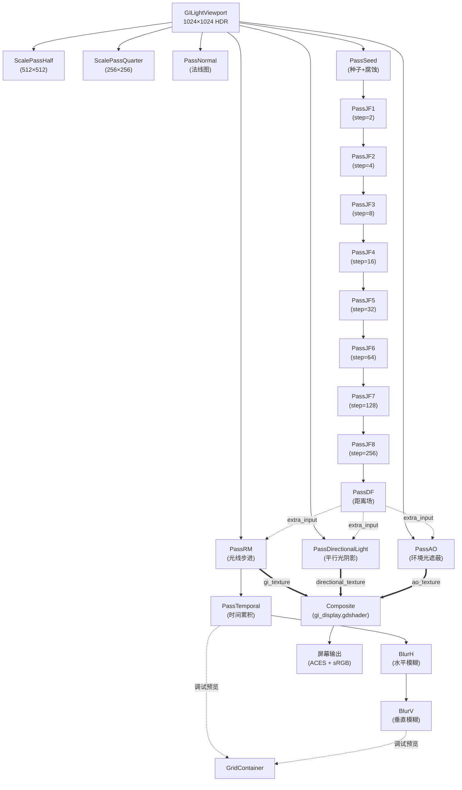

> 版本: 1.0 | 更新日期: 2026-06-24

# 架构设计

## 一、设计理念

本 GI 系统采用**自驱动 Pass 管线**架构，每个 ComputePass 节点独立管理自己的着色器编译、纹理分配、uniform 绑定和 dispatch 执行。无需中央编排器，Pass 之间通过场景树顺序和显式引用自动连接。

**核心原则：**
- 每个 Pass 是一个独立的 Node，挂载到场景树即可工作
- Pass 之间通过 RID（Render Device ID）共享纹理，零拷贝
- 帧计数机制防止重复消费，确保数据一致性
- 子类只需实现钩子函数，基类处理所有底层逻辑

---

## 二、ComputePass 基类

**文件**: [compute_pass.gd](file:///c:/Users/14194/Documents/Ants-at-world/experiments/gi/compute_pass.gd)
**类**: `ComputePass extends Node`

### 2.1 统一 Binding 布局

所有 compute shader 遵循统一的 binding 约定：

| Binding | 类型 | 用途 | Uniform 类型 |
|---------|------|------|-------------|
| 0 | `sampler2D` | 主输入纹理（只读采样） | `UNIFORM_TYPE_SAMPLER_WITH_TEXTURE` |
| 1 | `image2D` | 输出纹理（可写 storage image） | `UNIFORM_TYPE_IMAGE` |
| 2+ | `sampler2D` | 额外输入纹理（只读，按 `extra_input_sources` 顺序） | `UNIFORM_TYPE_SAMPLER_WITH_TEXTURE` |

**采样器配置**: 最近邻过滤（`NEAREST`），无各向异性，无 mipmap。

### 2.2 主输入来源优先级

`_process()` 中按以下优先级解析主输入 RID：

```
① input_texture（直接纹理，最高优先级）
    ↓ 未设置
② source_viewport（视口纹理）
    ↓ 未设置
③ primary_input（指定 ComputePass 的输出）
    ↓ 未设置
④ 前一个启用的 ComputePass 兄弟节点（场景树中位于本节点之前的最近 ComputePass）
```

**兄弟链式连接机制**: 当 Pass 未显式指定 `primary_input` 时，基类会向前遍历场景树兄弟节点，找到第一个启用的 ComputePass 作为输入源。这使得 JF 链路（PassJF1→PassJF2→...→PassJF8）无需手动配置依赖即可自动串联。

### 2.3 自驱动执行流程

```
_process(delta)
    │
    ├─ 1. 解析主输入 RID（按优先级链）
    ├─ 2. 解析额外输入 RID（extra_input_sources）
    ├─ 3. 检查输入就绪 & 帧计数防重复消费
    │      └─ 若输入无新输出 → return（跳过本帧）
    ├─ 4. 创建/重建输出纹理（尺寸或格式变化时）
    │      └─ 触发 _on_output_texture_created() 回调
    ├─ 5. _before_dispatch() 钩子（如 JumpFloodPass 计算 step）
    ├─ 6. 获取内部额外输入 RID（_get_internal_extra_resource_ids）
    ├─ 7. 构建/更新 uniform set（脏标记驱动）
    ├─ 8. dispatch（compute_list_begin → bind → set_push_constant → dispatch → end）
    ├─ 9. 更新 display_texture（供 TextureRect 预览）
    └─ 10. _after_dispatch() 钩子（如 TemporalPass 复制历史纹理）
```

### 2.4 帧计数与防重复消费

每个 Pass 维护 `frame_counter`（每次成功 dispatch 后 +1）和 `_last_consumed_frame` 字典（记录每个输入 Pass 已消费的帧号）。

**规则:**
- 当 `source_viewport` 存在时：视口纹理视为每帧更新，主输入始终有效
- 当依赖其他 Pass 时：仅当输入 Pass 的 `frame_counter > _last_consumed_frame[该Pass]` 时才执行
- 执行后更新 `_last_consumed_frame`，防止同一输入被多次消费

**作用**: 避免 Pass 在输入未更新时重复计算，节省 GPU 资源。

### 2.5 子类钩子

| 钩子 | 签名 | 调用时机 | 典型用途 |
|------|------|---------|---------|
| `_init()` | `() -> void` | 对象创建 | 设置 `shader_path` |
| `_before_dispatch` | `(src_w: int, src_h: int) -> void` | dispatch 前 | 计算动态参数（如 JF step） |
| `_after_dispatch` | `() -> void` | dispatch 后 | 复制输出到内部纹理（如历史帧） |
| `_get_push_data` | `() -> PackedByteArray` | dispatch 前 | 返回 push constant 数据 |
| `_on_output_texture_created` | `() -> void` | 输出纹理创建/重建 | 同步重建内部纹理 |
| `_get_internal_extra_resource_ids` | `() -> Array[RID]` | uniform 构建前 | 返回内部额外输入 RID |
| `_get_output_dimensions` | `(src_w, src_h) -> Vector2i` | 输出纹理创建前 | 覆盖输出尺寸（如 ScalePass） |
| `_get_output_format` | `(src_format: int) -> int` | 输出纹理创建前 | 覆盖输出格式（如 SeedPass 强制 RGBA16F） |

### 2.6 资源生命周期

| 阶段 | 操作 |
|------|------|
| `_ready()` | 加载 RDShaderFile → 编译 SPIRV → 创建 compute pipeline → 创建最近邻采样器 |
| `_process()` | 按需创建/重建输出纹理 → 构建 uniform set → dispatch |
| `_exit_tree()` | 释放所有 RID：uniform set、输出纹理、pipeline、shader、sampler、storage copy |

### 2.7 Dispatch 参数

- 工作组大小: `16×16`（所有 shader 的 `local_size`）
- dispatch 组数: `ceili(width/16) × ceili(height/16)`
- 最少 1 组（`maxi(1, ...)`）

---

## 三、管线数据流

### 3.1 实际场景数据流（gi.tscn）



**图例:**
- `==>` 实线粗箭头: 最终合成取用
- `-->` 实线: 主输入链路
- `-.->` 虚线: 额外输入 / 调试预览

### 3.2 距离场 — 核心共享资源

`PassDF`（距离场）是整个管线的核心共享资源，被三个光照 Pass 共享为 `extra_input`：

| 消费者 | binding | 用途 |
|--------|---------|------|
| PassRM | binding 2 | 距离场加速光线步进 |
| PassDirectionalLight | binding 2 | 距离场加速阴影射线 |
| PassAO | binding 2 | 距离场方向引导采样 |

这三个 Pass 都以 `source_viewport`（场景纹理）为主输入、`PassDF` 为额外输入，**彼此无依赖可并行**。当前通过场景树顺序串行执行。

### 3.3 兄弟链式连接

场景中 `Composite` 下的 Pass 节点按顺序排列，未显式指定 `primary_input` 的 Pass 会自动取场景树中前一个启用的 ComputePass 兄弟节点作为主输入：

```
PassSeed (source=viewport) → PassJF1 (取 PassSeed) → PassJF2 (取 PassJF1) → ... → PassJF8 → PassDF (取 PassJF8)
PassRM (source=viewport) → PassTemporal (取 PassRM) → BlurH (取 PassTemporal) → BlurV (取 BlurH)
```

### 3.4 合成方式

最终合成在 `Composite` ColorRect 节点上通过 `gi_display.gdshader`（canvas_item shader）完成，而非 compute shader。每帧由 `GDScript_composite` 脚本将三个 Pass 的输出 RID 注入 shader uniform：

```gdscript
# 每帧注入
gi_texture   ← PassRM.get_output_resource_id()
directional_texture ← PassDirectionalLight.get_output_resource_id()
ao_texture   ← PassAO.get_output_resource_id()
```

**注意**: 当前 `gi_texture` 取自 `PassRM`（未降噪），`PassTemporal`/`BlurH`/`BlurV` 的输出仅用于 GridContainer 调试预览。如需接入降噪链路，修改 Composite 脚本的 `pass_gi` 指向即可。

---

## 四、辅助系统

### 4.1 GILightViewport

**文件**: [gi_light_viewport.gd](file:///c:/Users/14194/Documents/Ants-at-world/experiments/gi/gi_light_viewport.gd)
**类**: `GILightViewport extends SubViewport`

- 1024×1024 HDR 透明 SubViewport
- `render_target_update_mode = UPDATE_ALWAYS`（每帧渲染）
- 内部 Camera2D 在 `_process` 中跟随主视口相机变换，保证 GI 视口与主场景视角同步

### 4.2 GIElement

**文件**: [gi_element.gd](file:///c:/Users/14194/Documents/Ants-at-world/experiments/gi/gi_element.gd)
**类**: `GIElement extends Node2D`

- `_ready`: 将所有子 Node2D reparent 到 GILightViewport（让发光体/障碍物渲染到 GI 视口）
- `_process`: 同步子节点的 global_transform 到原父节点变换（保持世界位置一致）

### 4.3 TextureFromPass

**文件**: [texture_from_pass.gd](file:///c:/Users/14194/Documents/Ants-at-world/experiments/gi/texture_from_pass.gd)
**类**: `TextureFromPass extends TextureRect`

- 调试辅助：每帧把指定 ComputePass 的输出 RID 写入自身纹理
- 用于 GridContainer 中的中间结果预览

### 4.4 MouseBall

**文件**: [mouse_ball.gd](file:///c:/Users/14194/Documents/Ants-at-world/experiments/gi/mouse_ball.gd)
**类**: `MouseBall extends Sprite2D`

- 跟随鼠标的发光小球（lerp 平滑跟随），用于测试动态光源

---

## 五、文件清单

### 5.1 脚本文件（.gd）

| 文件 | 类名 | 继承 | 作用 |
|------|------|------|------|
| `compute_pass.gd` | `ComputePass` | `Node` | 抽象基类 |
| `scale_pass.gd` | `ScalePass` | `ComputePass` | 纹理缩放 |
| `seed_pass.gd` | `SeedPass` | `ComputePass` | JF 种子初始化 + 形态学腐蚀 |
| `jump_flood_pass.gd` | `JumpFloodPass` | `ComputePass` | 跳洪泛洪 |
| `distance_field_pass.gd` | `DistanceFieldPass` | `ComputePass` | Voronoi → 距离场 |
| `raymarch_pass.gd` | `RaymarchPass` | `ComputePass` | 光线步进直接光照 |
| `directional_light_pass.gd` | `DirectionalLightPass` | `ComputePass` | 平行光阴影 |
| `ao_pass.gd` | `AOPass` | `ComputePass` | 环境光遮蔽 |
| `temporal_pass.gd` | `TemporalPass` | `ComputePass` | 时间累积降噪 |
| `blur_pass.gd` | `BlurPass` | `ComputePass` | 可分离高斯模糊 |
| `normal_pass.gd` | `NormalPass` | `ComputePass` | 法线图生成 |
| `atrous_pass.gd` | `ATrousPass` | `ComputePass` | A-Trous 小波降噪（备用） |
| `indirect_pass.gd` | `IndirectPass` | `ComputePass` | 多跳间接光照（备用） |
| `composite_pass.gd` | `CompositePass` | `ComputePass` | compute 合成（备用） |
| `denoise_pass.gd` | `DenoisePass` | `ComputePass` | 双边滤波降噪（备用） |
| `sharpen_pass.gd` | `SharpenPass` | `ComputePass` | Unsharp Mask 锐化（备用） |
| `texture_from_pass.gd` | `TextureFromPass` | `TextureRect` | Pass 输出预览 |
| `gi_element.gd` | `GIElement` | `Node2D` | GI 场景元素容器 |
| `gi_light_viewport.gd` | `GILightViewport` | `SubViewport` | GI 光照视口 |
| `mouse_ball.gd` | `MouseBall` | `Sprite2D` | 鼠标跟随测试光源 |

### 5.2 Shader 文件

| 文件 | 类型 | 对应 Pass |
|------|------|-----------|
| `seed.glsl` | compute | SeedPass |
| `jump_flood.glsl` | compute | JumpFloodPass |
| `distance_field.glsl` | compute | DistanceFieldPass |
| `raymarch.glsl` | compute | RaymarchPass |
| `directional_light_pass.glsl` | compute | DirectionalLightPass |
| `ao_pass.glsl` | compute | AOPass |
| `temporal.glsl` | compute | TemporalPass |
| `blur.glsl` | compute | BlurPass |
| `normal_pass.glsl` | compute | NormalPass |
| `scale.glsl` | compute | ScalePass |
| `atrous.glsl` | compute | ATrousPass（备用） |
| `indirect_pass.glsl` | compute | IndirectPass（备用） |
| `composite_pass.glsl` | compute | CompositePass（备用） |
| `denoise.glsl` | compute | DenoisePass（备用） |
| `sharpen.glsl` | compute | SharpenPass（备用） |
| `gi_display.gdshader` | canvas_item | 最终合成 |
| `soil.gdshader` | canvas_item | 泥土背景 |

### 5.3 场景文件

| 文件 | 说明 |
|------|------|
| `gi.tscn` | GI 测试场景 |

---

## 六、术语表

| 术语 | 全称 | 说明 |
|------|------|------|
| GI | Global Illumination | 全局光照 |
| JFA | Jump Flood Algorithm | 跳洪算法，并行计算 Voronoi/距离场 |
| SDF | Signed Distance Field | 有向距离场 |
| DF | Distance Field | 距离场（本项目中 R=距离, GB=方向向量） |
| EMA | Exponential Moving Average | 指数移动平均 |
| AABB | Axis-Aligned Bounding Box | 轴对齐包围盒（用于 Temporal Clamp） |
| PCF | Percentage-Closer Filtering | 百分比渐近过滤（软阴影） |
| ACES | Academy Color Encoding System | 学院色彩编码系统（色调映射） |
| HDR | High Dynamic Range | 高动态范围 |
| RD | RenderingDevice | Godot 渲染设备 API |
| RID | Resource ID | Godot 资源 ID |
| dispatch | — | GPU 计算派发 |
| Pass | — | 管线中的一个处理阶段 |
| binding | — | shader 中的绑定点（uniform slot） |
| push constant | — | compute shader 的快速常量传递机制 |
