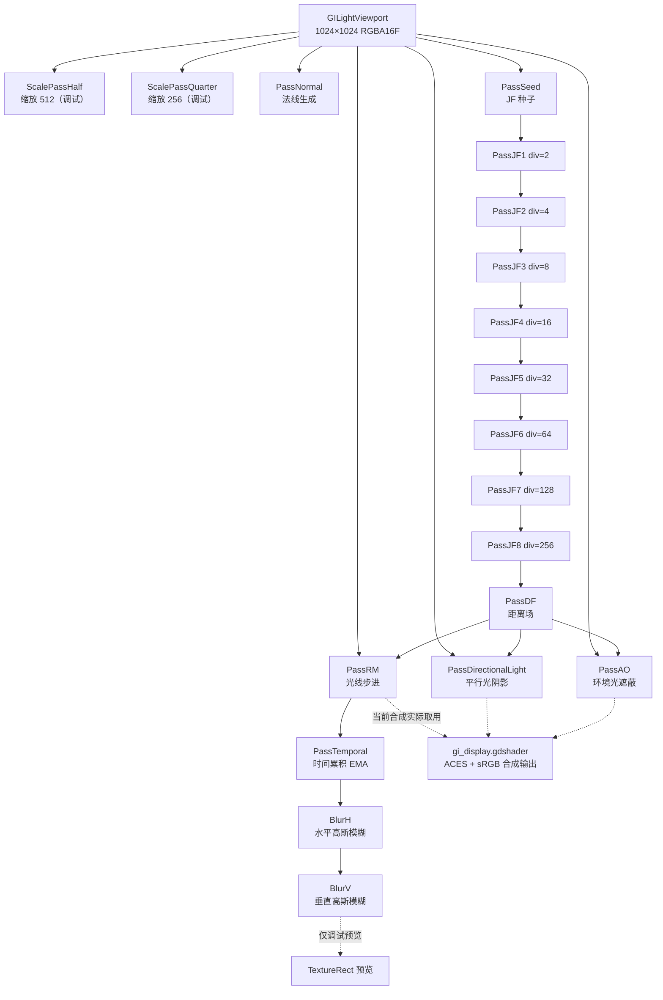

# 2D GI 优化分析

> 版本: 1.0 | 更新日期: 2026-06-24

本文档针对 Godot 4 的 2D GI（全局光照）系统（基于 Compute Shader 实现）整理效果与性能两方面的优化分析。所有结论均基于 `experiments/gi/` 目录下的实际代码与 `gi.tscn` 场景配置，并修正了早期 `GI_ANALYSIS.md` 中与现状不符的技术描述。

> **状态标注约定**：每条优化建议均标注当前实现状态。
> - 🟢 **已实现**：代码已存在且在 `gi.tscn` 中接入使用
> - 🟡 **部分实现**：代码已存在但未接入最终合成，或仅实现部分子项
> - 🔴 **未实现**：代码中尚不存在，需新增

---

## 一、当前管线总览

下图为 `gi.tscn` 中实际挂载的 Pass 及其数据流。实线表示参与最终合成的数据流，虚线表示仅用于调试预览（未接入 `gi_display.gdshader`）。

### 与早期文档（GI_ANALYSIS.md）的关键差异

| 项 | 早期文档描述 | 实际代码现状 |
|----|--------------|--------------|
| 降噪方式 | `ATrousPass ×3`（step=1,2,4） | `BlurH` + `BlurV` 可分离高斯模糊（`blur_pass.gd`） |
| 合成方式 | `CompositePass`（compute） | `gi_display.gdshader`（canvas_item 着色器） |
| `raymarch_num_samples` 默认值 | 8 | **4**（`raymarch_pass.gd`，场景中覆盖为 32） |
| `ao_num_samples` 默认值 | 16 | **8**（`ao_pass.gd`） |
| `temporal_blend_factor` 默认值 | 0.2 | **0.1**（`temporal_pass.gd`） |
| 法线生成 | 未提及 | **已新增 `NormalPass`**（Sobel 算子，`normal_pass.gd`） |
| 万花筒效果 | 未提及 | **已新增 `raymarch_rotation_offset` / `rotation_speed`** |
| AO 采样策略 | 纯黄金角度 | **已实现距离场引导采样**（`ao_df_guide_weight`） |
| 多跳间接光照 | 建议新增 | **`IndirectPass` 已实现**（`indirect_pass.gd`），但场景未使用 |

---

## 二、效果优化

### 2.1 多跳间接光照（2-bounce GI）

**实现状态：🟡 部分实现**

`IndirectPass`（`indirect_pass.gd`）已完整实现：输入直接光照结果（RaymarchPass）+ 场景纹理 + 距离场，对每个被照亮的非发光像素追踪次级光线收集间接光，支持 `indirect_num_samples`、`indirect_attenuation`、`indirect_strength` 等参数。但该 Pass **未在 `gi.tscn` 中挂载**，当前场景仅输出直接光照。

**优化建议：**
1. **接入场景**：在 `gi.tscn` 的 `Composite` 节点下新增 `PassIndirect`，`primary_input` 指向 `PassRM`，`extra_input_sources` 指向 `PassDF`，并将 `gi_display.gdshader` 的 `gi_texture` 改指向 `PassIndirect` 输出。
2. **强度调优**：`indirect_strength` 默认 0.5，接入后建议从 0.3 起调，避免色彩溢出过强。
3. **采样复用**：接入后可将 `raymarch_num_samples` 从 32 降至 4–8，由间接 Pass 承担反弹采样，配合时间累积补偿噪声。

---

### 2.2 距离场引导 AO 采样

**实现状态：🟢 已实现**

`AOPass` 已实现距离场引导采样（`ao_df_guide_weight`，默认 0.5）。权重为 0 时纯黄金角度分布，为 1 时纯距离场方向引导，利用距离场 GB 通道（指向最近异质点的方向向量）优先在可能有遮挡的方向采样。

**优化建议：**
1. **权重调优**：当前 0.5 为折中值。平坦场景可降至 0.2–0.3 保留均匀性；复杂几何场景可提至 0.7–0.8 增强遮蔽精度。
2. **半球采样** 🔴 **未实现**：当前为全圆采样。对地面像素应只采样上半球方向，避免地面下方无效采样造成的过度遮蔽。
3. **多尺度 AO** 🔴 **未实现**：类似 HBAO，在不同半径下计算 AO 并混合，兼顾近处细节与远处大范围遮蔽。

---

### 2.3 法线图生成与双边滤波引导

**实现状态：🟢 已实现（法线生成）/ 🔴 未实现（用于降噪）**

`NormalPass`（`normal_pass.gd`）已实现并在场景中挂载（`PassNormal`，`normal_blur_radius=2`）。原理是利用场景纹理 Alpha 通道表示的表面高度，通过 Sobel 算子计算高度梯度，梯度方向即高度场法线；`alpha=0` 的空区法线指向正面 `(0,0,1)`。

但当前法线图**仅用于调试预览**，未接入任何双边滤波权重。

**优化建议：**
1. **法线权重接入降噪** 🔴 **未实现**：将 `PassNormal` 输出作为 `BlurH`/`BlurV` 或未来 `ATrousPass` 的额外输入，在双边权重中加入法线权重 `w_n = exp(-dot(N1,N2)²/σn²)`，防止不同表面光线渗透（light leaking）。
2. **法线引导间接光** 🔴 **未实现**：`IndirectPass` 接入后，可用法线剔除背向次级光线，提升间接光物理正确性。

---

### 2.4 万花筒/流光效果（射线旋转）

**实现状态：🟢 已实现**

`RaymarchPass` 已实现 `raymarch_rotation_offset`（初始旋转偏移，弧度）与 `raymarch_rotation_speed`（旋转速度，弧度/秒）。`_process` 中每帧自动累加 `raymarch_rotation_offset += raymarch_rotation_speed * delta`，利用视觉暂留效应在少量射线下产生动态万花筒/流光效果。

**优化建议：**
1. **低采样场景启用**：当 `raymarch_num_samples` 较低（3–4）时，设置 `rotation_speed` 为非零小值（如 0.5–1.0），可在不增加采样成本的前提下等效提升光线覆盖范围。
2. **静止场景慎用**：完全静态场景下非零 `rotation_speed` 会使光影持续流动，可能不符合预期；此时应设为 0 并依赖时间累积降噪。

---

### 2.5 可分离高斯模糊降噪

**实现状态：🟡 部分实现**

降噪方式已从早期的 `ATrousPass ×3` 改为 `BlurH` + `BlurV` 可分离高斯模糊（`blur_pass.gd`）。`BlurPass` 支持通道掩码（`blur_r/g/b/a`）、模糊半径（`blur_radius`，默认 4）、高斯标准差（`blur_sigma`，默认 3.0）和方向（`blur_direction`：0=水平，1=垂直）。`BlurH` → `BlurV` 串联执行，将 5×5 的 25 次采样拆为水平 5 + 垂直 5 = 10 次采样。

但当前 `gi_display.gdshader` 的 `pass_gi` 指向 `PassRM`（未降噪的直接光照），`TemporalPass`/`BlurH`/`BlurV` 链路**仅用于调试预览**，未接入最终合成。

**优化建议：**
1. **接入合成链路** 🔴 **未实现**：将 `gi_display.gdshader` 对应的 `pass_gi` 由 `PassRM` 改指向 `BlurV`，启用完整降噪链路。需注意过度模糊问题，建议同步降低 `blur_sigma` 或减小 `blur_radius`。
2. **保边滤波** 🔴 **未实现**：当前高斯模糊为纯颜色模糊，无保边能力。可引入距离场/法线双边权重，或保留 `ATrousPass`（代码仍存在 `atrous_pass.gd`）作为可选高质量降噪路径。
3. **自适应迭代次数** 🔴 **未实现**：根据 `TemporalPass` 帧计数动态调整模糊强度（首帧强模糊，累积后弱模糊）。

---

### 2.6 时间累积

**实现状态：🟡 部分实现**

`TemporalPass`（`temporal_pass.gd`）已实现帧间指数移动平均（EMA）：维护历史纹理（`_history_texture`），首帧 `blend=1.0` 直接用当前帧，之后用 `temporal_blend_factor`（默认 0.1）混合。dispatch 后将输出复制到历史纹理供下一帧使用。历史纹理作为内部额外输入绑定到 binding 2。

但存在两个问题：① **未接入最终合成**（同 2.5，仅调试预览）；② **无运动矢量**，仅靠历史纹理直接对应像素混合，场景运动时会产生残影或过度模糊。

**优化建议：**
1. **接入合成链路** 🔴 **未实现**：与 2.5 配合，将降噪链路接入 `gi_display.gdshader`。
2. **运动矢量** 🔴 **未实现**：在 `GILightViewport` 中追踪物体运动，`TemporalPass` 中按运动矢量重投影历史帧，消除运动残影。
3. **AABB Clamp** 🔴 **未实现**：早期文档提及的 AABB Clamp 在当前 `temporal.glsl` 中未确认存在，建议加入历史帧颜色钳制，防止拖尾。可在 YCoCg 色彩空间做 Clamp，比 RGB 空间更符合人眼感知。
4. **置信度权重** 🔴 **未实现**：根据历史与当前差异大小动态调整混合因子。

---

### 2.7 光线步进衰减模型

**实现状态：🟡 部分实现**

`RaymarchPass` 衰减模型仍为简单的 `1/(1+d*att)`（`raymarch_attenuation` 默认 3.0），缺乏物理正确性。光线遇到非发光固体即终止，仅收集直接发光体。

**优化建议：**
1. **物理衰减** 🔴 **未实现**：使用 `1/d²` 物理衰减替代当前线性衰减，使远处光照更符合能量守恒。
2. **重要性采样** 🔴 **未实现**：当前使用均匀黄金角度分布。可根据距离场方向偏向更有可能命中光源的方向采样。
3. **辐射度缓存** 🔴 **未实现**：对空间上接近的像素复用光线命中结果，减少光线总数。

---

### 2.8 平行光阴影

**实现状态：🟡 部分实现**

`DirectionalLightPass` 已实现（场景中 `light_direction=(-1,1)`），带高度场阴影。但阴影无半影效果，过渡可能生硬。

**优化建议：**
1. **百分比渐近过滤（PCF）** 🔴 **未实现**：在阴影判定时采样多个邻近像素，产生软阴影。
2. **二次高度插值** 🔴 **未实现**：使用 `smoothstep` 替代线性插值，阴影过渡更自然。
3. **可变步长** 🔴 **未实现**：根据距离场动态调整步长，近距离小步长保精度，远距离大步长保速度。

---

## 三、性能优化

### 3.1 Jump Flood 链路优化（最大瓶颈）

**实现状态：🔴 未实现（优化项）**

**现状：** `gi.tscn` 中挂载 8 个 `JumpFloodPass`（divisor=2,4,8,16,32,64,128,256），每个 pass 对全图每像素做 3×3=9 次纹理采样。1024×1024 分辨率下总计：
- 8 passes × 1024² × 9 samples ≈ **7500 万次纹理采样/帧**

`JumpFloodPass` 支持 `use_square_step`（默认 true，避免各向异性条纹）和 `jump_flood_step_divisor`（步长除数，自动计算 `step = max(1, size / divisor)`）。

**优化方案：**

| 方案 | 预期收益 | 复杂度 | 实现状态 |
|------|----------|--------|----------|
| 减少到 6 passes（divisor 4,8,16,32,64,128） | -25% 采样 | 低 | 🔴 未实现 |
| 1+1 JFA（正反两次 JFA） | -50% 采样，精度不降 | 中 | 🔴 未实现 |
| 仅在分辨率变化时重算距离场 | -90%+（静态场景） | 中 | 🔴 未实现 |
| 半分辨率距离场 | -75% 采样 | 低 | 🔴 未实现 |

**推荐：** 距离场在场景几何不变时无需重算。添加脏标记，仅在源视口内容变化时重新执行 `SeedPass`→`JF×8`→`DF` 链路。

---

### 3.2 距离场脏标记

**实现状态：🔴 未实现**

**现状：** `ComputePass` 基类（`compute_pass.gd`）通过 `frame_counter` 与 `_last_consumed_frame` 防止重复消费输入，但 **JF 链路每帧均会执行**，即使场景几何完全静止。

`ComputePass` 的自驱动机制：`_process` 中按优先级获取主输入（`input_texture` → `source_viewport` → `primary_input` → 前一个兄弟 ComputePass），输入就绪且帧计数更新后才 dispatch。

**优化建议：**
1. **脏标记** 🔴 **未实现**：在 `GILightViewport` 中检测场景几何是否变化（如通过哈希或区域标记），仅在变化时标记 `SeedPass`/`JF`/`DF` 链路需要重算，静止帧直接复用上一帧距离场。
2. **预期收益**：静态场景下 JF 链路耗时降低 90%+。

---

### 3.3 纹理格式优化

**实现状态：🔴 未实现**

**现状：** 几乎所有中间纹理使用 RGBA16F（64 bits/pixel）。`ComputePass._get_output_format` 默认继承源格式，仅 `JumpFloodPass` 显式返回 `DATA_FORMAT_R16G16B16A16_SFLOAT`。

| 纹理 | 当前格式 | 可用格式 | 节省 | 实现状态 |
|------|----------|----------|------|----------|
| SeedPass / JumpFlood | RGBA16F (64bit) | RG16F + RG16F 拆分 | 已较优 | — |
| DistanceField | RGBA16F (64bit) | R16G16B16_SFLOAT (48bit)¹ | -25% | 🔴 未实现 |
| AOPass 输出 | RGBA16F (64bit) | R8_UNORM (8bit) | -87% | 🔴 未实现 |
| DirectionalLight 输出 | RGBA16F (64bit) | RG16F (32bit)² | -50% | 🔴 未实现 |
| NormalPass 输出 | RGBA16F (64bit) | R16G16B16_SFLOAT (48bit) | -25% | 🔴 未实现 |

¹ 距离场 R=距离, GB=方向，实际只需 3 通道
² 平行光输出 R=可见性, G=遮挡距离，仅需 2 通道

**优化建议：** 在各 Pass 中覆盖 `_get_output_format` 返回更紧凑格式。注意 `TemporalPass` 历史纹理格式需与输出格式同步（`_on_output_texture_created` 中已使用 `_output_format`，无需额外处理）。

---

### 3.4 分辨率分层

**实现状态：🟡 部分实现**

**现状：** 场景中已存在 `ScalePassHalf`（512×512）与 `ScalePassQuarter`（256×256），但**仅用于调试预览**（挂载到 `GridContainer` 的 `TextureRect`）。所有 GI Pass（JF、DF、RM、AO、Dir）仍在 1024×1024 全分辨率执行。

`ComputePass` 已提供 `_get_output_dimensions` 钩子，子类可覆盖返回自定义尺寸，基础设施已就绪。

**优化方案：**

| Pass | 建议分辨率 | 理由 | 实现状态 |
|------|-----------|------|----------|
| 距离场（JF+DF） | 半分辨率 512×512 | 足够引导光线步进 | 🔴 未实现 |
| Raymarch | 半分辨率 512×512 | 通过 TemporalPass + Blur 恢复质量 | 🔴 未实现 |
| AO | 1/4 分辨率 256×256 | AO 本身为低频信息 | 🔴 未实现 |
| DirectionalLight | 全分辨率 1024×1024 | 阴影边缘需保持锐利 | — |
| 最终输出 | bicubic 上采样回全分辨率 | — | 🔴 未实现 |

**预期总纹理采样减少 ~60%。**

---

### 3.5 Dispatch 合并

**实现状态：🔴 未实现**

**现状：** 每个 Pass 在 `_process` 中独立调用 `compute_list_begin`/`compute_list_end`，存在多次命令开销。`ComputePass` 的 dispatch 分组为 `ceili(width/16) × ceili(height/16)`，16×16 线程组。

**优化建议：**
1. **合并无依赖 Pass** 🔴 **未实现**：`PassDirectionalLight` 与 `PassAO` 互不依赖（均依赖 `PassDF`），可合并到同一 `compute_list` 中，减少 GPU 命令开销。
2. **实现难点**：当前架构为每个 Pass 自驱动 `_process`，合并需引入中央编排器或 PassGraph（见 3.7）。

---

### 3.6 共享内存优化

**实现状态：🔴 未实现**

**现状：** 所有 Pass 使用 `imageLoad`/`texture()` 全局内存采样。

**优化建议：**
1. **共享内存预加载** 🔴 **未实现**：在 `BlurH`/`BlurV` 与 `TemporalPass` 中使用 GLSL `shared` memory 预加载邻域数据，减少全局内存访问。16×16 线程组共享 18×18 像素数据，每像素仅 1 次全局加载。
2. **适用场景**：模糊类 Pass 邻域采样密集，收益最大。

---

### 3.7 架构改进

**实现状态：🔴 未实现**

**现状：** `ComputePass` 通过 `primary_input` 和 `extra_input_sources` 手动指定依赖，通过 `frame_counter` 防止重复消费。兄弟节点按 `get_index()` 顺序自动链式连接（向前查找最近启用的兄弟 ComputePass）。

**问题：**
- 无法表达并行分支（`PassDirectionalLight` 和 `PassAO` 互不依赖但都依赖 `PassDF`）
- 场景树顺序即执行顺序，不直观

**优化建议：**
1. **PassGraph 依赖图** 🔴 **未实现**：引入显式 PassGraph 资源，声明式描述依赖关系，自动拓扑排序并调度并行 Pass。
2. **动态分辨率** 🔴 **未实现**：根据帧率自动调整 Raymarch 分辨率。低于 60fps 降级到 512×512，高于 120fps 升到 2048×2048。
3. **调试视图切换器** 🔴 **未实现**：当前通过 `GridContainer` 罗列所有 `TextureRect` 预览，可改为单视图切换，单独查看距离场热力图、AO 因子、降噪前后对比等。

---

## 四、关键参数调优指南

> 下表"默认值"为代码 `@export` 默认值；"场景值"为 `gi.tscn` 中的覆盖值（未覆盖则同默认值）。

### RaymarchPass（`raymarch_pass.gd`）

| 参数 | 数据类型 | 默认值 | 场景值 | 推荐范围 | 说明 |
|------|----------|--------|--------|----------|------|
| `raymarch_num_samples` | `int` | 4 | 32 | 4–16 | 每像素光线数，接入 IndirectPass 后可降至 4 |
| `raymarch_attenuation` | `float` | 3.0 | — | 1.0–5.0 | 越大光衰减越快，场景越暗 |
| `raymarch_max_distance` | `float` | 0.8 | — | 0.3–0.9 | 降低可提升性能但减少远处光照 |
| `raymarch_max_steps` | `int` | 32 | — | 16–64 | 距离场加速下 32 步通常足够 |
| `raymarch_emissive_threshold` | `float` | 0.01 | — | 0.01–1.0 | 任意通道 ≥ 此值视为发光体 |
| `raymarch_step_safety` | `float` | 0.8 | — | 0.5–0.95 | <1.0 防止步进越过薄壁漏光 |
| `raymarch_rotation_offset` | `float` | 0.0 | — | 0–2π | 射线初始旋转偏移（弧度） |
| `raymarch_rotation_speed` | `float` | 0.0 | — | 0–2.0 | 旋转速度（弧度/秒），0=静止 |

### AOPass（`ao_pass.gd`）

| 参数 | 数据类型 | 默认值 | 场景值 | 推荐范围 | 说明 |
|------|----------|--------|--------|----------|------|
| `ao_num_samples` | `int` | 8 | — | 8–32 | 接入 Temporal 后可保持 8 |
| `ao_radius` | `float` | 0.05 | — | 0.02–0.1 | 采样半径（归一化），越大遮蔽范围越广 |
| `ao_intensity` | `float` | 1.0 | — | 0.5–2.0 | 遮蔽强度系数，越大越暗 |
| `ao_falloff` | `float` | 1.0 | — | 0.5–2.0 | 遮蔽衰减指数 |
| `ao_bias` | `float` | 0.01 | — | 0.005–0.02 | 高度偏移，防止自遮挡 |
| `ao_df_guide_weight` | `float` | 0.5 | — | 0.0–1.0 | 距离场引导权重，0=纯黄金角度，1=纯距离场引导 |

### TemporalPass（`temporal_pass.gd`）

| 参数 | 数据类型 | 默认值 | 场景值 | 推荐范围 | 说明 |
|------|----------|--------|--------|----------|------|
| `temporal_blend_factor` | `float` | 0.1 | — | 0.05–0.3 | 当前帧混合权重，越低越平滑但延迟越大 |

### BlurPass（`blur_pass.gd`，BlurH / BlurV）

| 参数 | 数据类型 | 默认值 | 场景值 | 推荐范围 | 说明 |
|------|----------|--------|--------|----------|------|
| `blur_radius` | `int` | 4 | — | 2–8 | 模糊核半径（像素） |
| `blur_sigma` | `float` | 3.0 | — | 1.0–5.0 | 高斯标准差 |
| `blur_r` | `bool` | `true` | — | — | 是否模糊 R 通道 |
| `blur_g` | `bool` | `true` | — | — | 是否模糊 G 通道 |
| `blur_b` | `bool` | `true` | — | — | 是否模糊 B 通道 |
| `blur_a` | `bool` | `false` | — | — | 是否模糊 A 通道 |
| `blur_direction` | `int` | 0 | H=0 / V=1 | 0–1 | 模糊方向：0=水平，1=垂直 |

### IndirectPass（`indirect_pass.gd`，场景未使用）

| 参数 | 数据类型 | 默认值 | 场景值 | 推荐范围 | 说明 |
|------|----------|--------|--------|----------|------|
| `indirect_num_samples` | `int` | 4 | 未挂载 | 2–8 | 每像素次级光线数 |
| `indirect_attenuation` | `float` | 5.0 | 未挂载 | 3.0–8.0 | 间接光衰减系数 |
| `indirect_max_distance` | `float` | 0.5 | 未挂载 | 0.2–0.8 | 最大搜索距离（归一化） |
| `indirect_max_steps` | `int` | 24 | 未挂载 | 16–32 | 最大步进次数 |
| `indirect_emissive_threshold` | `float` | 1.0 | 未挂载 | 0.5–2.0 | 发光阈值 |
| `indirect_step_safety` | `float` | 0.8 | 未挂载 | 0.5–0.95 | 步进安全系数 |
| `indirect_strength` | `float` | 0.5 | 未挂载 | 0.2–1.0 | 间接光强度倍数 |

### NormalPass（`normal_pass.gd`）

| 参数 | 数据类型 | 默认值 | 场景值 | 推荐范围 | 说明 |
|------|----------|--------|--------|----------|------|
| `normal_blur_radius` | `int` | 1 | 2 | 1–2 | Sobel 采样半径，1=3×3，2=5×5 |

### JumpFloodPass（`jump_flood_pass.gd`）

| 参数 | 数据类型 | 默认值 | 场景值 | 推荐范围 | 说明 |
|------|----------|--------|--------|----------|------|
| `jump_flood_step_divisor` | `int` | 0 | 2–256 | — | 步长除数，自动计算 `step = max(1, size/divisor)` |
| `use_square_step` | `bool` | `true` | — | — | 是否使用方形步长，避免各向异性条纹 |

---

## 五、优化实施路线

### 阶段一：性能基础（优先级：高）

| 任务 | 预期收益 | 涉及文件 | 实现状态 |
|------|----------|----------|----------|
| 距离场脏标记：场景静止时跳过 JF 链路 | -90% 静态场景耗时 | `compute_pass.gd`, `gi.tscn` | 🔴 未实现 |
| 距离场半分辨率计算 | -75% JF 采样 | `distance_field_pass.gd`, `jump_flood_pass.gd` | 🔴 未实现 |
| AO 降至 1/4 分辨率 | -93% AO 采样 | `ao_pass.gd` | 🔴 未实现 |
| 纹理格式精简 | -30% 显存带宽 | 各 `*_pass.gd` 的 `_get_output_format` | 🔴 未实现 |

### 阶段二：效果提升（优先级：中）

| 任务 | 效果提升 | 涉及文件 | 实现状态 |
|------|----------|----------|----------|
| 接入 `IndirectPass`（2-bounce） | 间接光更真实，色彩溢出 | `gi.tscn` 重新连线 | 🟡 部分实现（代码已就绪） |
| 降噪链路接入 `gi_display.gdshader` | 启用完整降噪 | `gi.tscn` 改 `pass_gi` 指向 | 🟡 部分实现（链路已就绪） |
| AO 接入 TemporalPass | AO 噪声大幅降低 | `gi.tscn` 重新连线 | 🔴 未实现 |
| 法线权重接入双边滤波 | 减少光线渗透 | `blur.glsl`, `normal_pass.gd` | 🔴 未实现 |
| 软阴影（PCF） | 阴影边缘自然过渡 | `directional_light_pass.glsl` | 🔴 未实现 |

### 阶段三：高级特性（优先级：低）

| 任务 | 效果 | 涉及文件 | 实现状态 |
|------|------|----------|----------|
| 运动矢量 + 重投影 | 消除运动残影 | 新增 `motion_vector_pass`, `temporal.glsl` | 🔴 未实现 |
| 辐射度缓存 | 降低 Raymarch 采样需求 | 新增 `radiosity_cache_pass` | 🔴 未实现 |
| 多尺度 AO | 兼顾近处细节与远处遮蔽 | `ao_pass.glsl` | 🔴 未实现 |
| 自适应采样 | 高频区域多采样 | `raymarch.glsl` | 🔴 未实现 |

### 阶段四：工程化（优先级：低）

| 任务 | 效果 | 涉及文件 | 实现状态 |
|------|------|----------|----------|
| PassGraph 依赖图 | 声明式管线，支持并行调度 | 新增 `pass_graph.gd` | 🔴 未实现 |
| 调试视图切换器 | 开发效率提升 | 新增 `debug_view.gd` | 🔴 未实现 |
| 动态分辨率 | 自适应性能 | `compute_pass.gd` | 🔴 未实现 |
| 共享内存优化 | 降低带宽瓶颈 | `blur.glsl`, `temporal.glsl` | 🔴 未实现 |

---

## 六、总结

当前管线已实现完整的 2D GI 基础框架：距离场加速光线步进、时间累积、可分离高斯模糊降噪、法线生成、距离场引导 AO 采样、射线旋转万花筒效果，并预留了多跳间接光照 Pass。相对早期 `GI_ANALYSIS.md` 的描述，系统已在降噪与合成方式上完成重构。

**当前主要问题：**

1. **降噪链路未接入合成** 🟡：`TemporalPass`/`BlurH`/`BlurV` 已实现且在场景中执行，但 `gi_display.gdshader` 实际取用 `PassRM` 未降噪输出，降噪链路仅用于调试预览。这是最高性价比的改进点——仅需在 `gi.tscn` 中将 `pass_gi` 改指向 `BlurV` 即可启用。
2. **Jump Flood 链路过重** 🔴：8 个 Pass 始终全分辨率执行，是最大性能瓶颈。
3. **多跳间接光照未接入** 🟡：`IndirectPass` 代码已就绪但场景未挂载，当前仅直接光照。
4. **时间累积无运动矢量** 🔴：运动场景下效果退化。
5. **AO 未接入降噪管线** 🔴：独立运行，噪声无法消除。

**优先实施建议：** 先以零成本启用降噪链路接入（改 `gi.tscn` 连线），再实施距离场脏标记与分辨率分层获得最大性能收益（预期帧时间降低 50%+）；随后接入 `IndirectPass` 与 AO 时间累积，可显著提升视觉质量。
